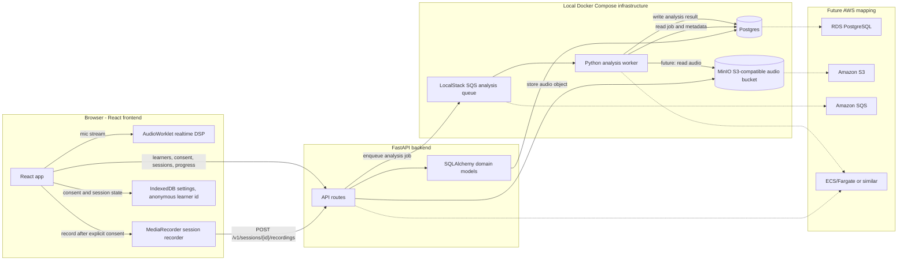

# System Diagram

```mermaid
flowchart LR
  subgraph Browser["Browser - React frontend"]
    UI["React app"]
    Worklet["AudioWorklet realtime DSP"]
    Recorder["MediaRecorder session recorder"]
    IndexedDB["IndexedDB settings, anonymous learner id"]
  end

  subgraph Backend["FastAPI backend"]
    API["API routes"]
    Models["SQLAlchemy domain models"]
  end

  subgraph LocalInfra["Local Docker Compose infrastructure"]
    Postgres[("Postgres")]
    MinIO[("MinIO S3-compatible audio bucket")]
    SQS["LocalStack SQS analysis queue"]
    Worker["Python analysis worker"]
  end

  UI -->|"mic stream"| Worklet
  UI -->|"consent and session state"| IndexedDB
  UI -->|"record after explicit consent"| Recorder
  Recorder -->|"POST /v1/sessions/{id}/recordings"| API
  UI -->|"learners, consent, sessions, progress"| API

  API --> Models
  Models --> Postgres
  API -->|"store audio object"| MinIO
  API -->|"enqueue analysis job"| SQS
  SQS --> Worker
  Worker -->|"read job and metadata"| Postgres
  Worker -->|"future: read audio"| MinIO
  Worker -->|"write analysis result"| Postgres

  subgraph AWS["Future AWS mapping"]
    RDS["RDS PostgreSQL"]
    S3["Amazon S3"]
    AmazonSQS["Amazon SQS"]
    Containers["ECS/Fargate or similar"]
  end

  Postgres -.-> RDS
  MinIO -.-> S3
  SQS -.-> AmazonSQS
  API -.-> Containers
  Worker -.-> Containers
```
