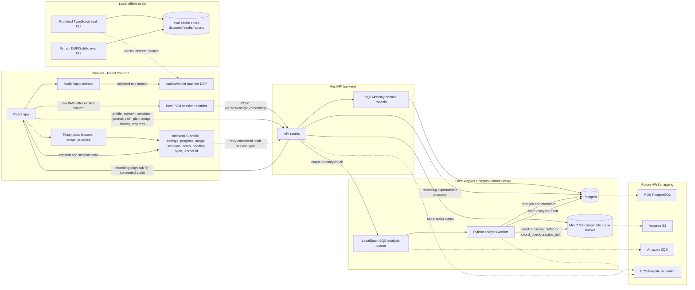

# System Diagram

```mermaid
flowchart LR
  subgraph Browser["Browser - React frontend"]
    UI["React app"]
    Today["Today plan, lessons, songs, progress"]
    MicSelect["Audio input selector"]
    Worklet["AudioWorklet realtime DSP"]
    Recorder["Raw PCM session recorder"]
    IndexedDB["IndexedDB profile, settings, progress, songs, sessions, notes, pending sync, learner id"]
  end

  subgraph Backend["FastAPI backend"]
    API["API routes"]
    Models["SQLAlchemy domain models"]
  end

  subgraph LocalEval["Local offline evals"]
    EvalCache[(".eval-cache chord datasets/results/reports")]
    FrontendEval["Frontend TypeScript eval CLI"]
    PyEval["Python DSP/Solitito eval CLI"]
  end

  subgraph LocalInfra["Local Docker Compose infrastructure"]
    Postgres[("Postgres")]
    MinIO[("MinIO S3-compatible audio bucket")]
    SQS["LocalStack SQS analysis queue"]
    Worker["Python analysis worker"]
  end

  UI --> Today
  Today --> IndexedDB
  UI --> MicSelect
  MicSelect -->|"selected mic stream"| Worklet
  UI -->|"consent and session state"| IndexedDB
  UI -->|"raw WAV after explicit consent"| Recorder
  Recorder -->|"POST /v1/sessions/{id}/recordings"| API
  UI -->|"profile, consent, sessions, journal, path, plan, songs, history, progress"| API
  IndexedDB -.->|"retry completed local session sync"| API
  API -->|"recording playback for consented audio"| UI

  API --> Models
  Models --> Postgres
  API -->|"recording export/delete metadata"| Postgres
  API -->|"store audio object"| MinIO
  API -->|"enqueue analysis job"| SQS
  SQS --> Worker
  Worker -->|"read job and metadata"| Postgres
  Worker -->|"read consented WAV for chord_check/practice_drill"| MinIO
  Worker -->|"write analysis result"| Postgres
  FrontendEval -.->|"reuses detector source"| Worklet
  FrontendEval --> EvalCache
  PyEval --> EvalCache

  subgraph AWS["Future AWS mapping"]
    RDS["RDS PostgreSQL"]
    S3["Amazon S3"]
    AmazonSQS["Amazon SQS"]
    Containers["ECS/Fargate or similar"]
  end

  Postgres -.-> RDS
  MinIO -.-> S3
  SQS -.-> AmazonSQS
  API -.-> Containers
  Worker -.-> Containers
```
